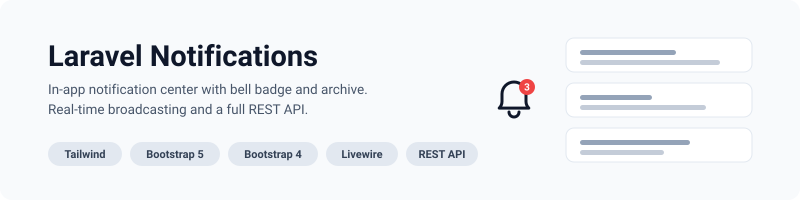

<p align="center">
    <picture>
        <source media="(prefers-color-scheme: dark)" srcset="art/banner-dark.svg">
        <source media="(prefers-color-scheme: light)" srcset="art/banner-light.svg">
        
    </picture>
</p>

# Laravel Notifications

A complete in-app notification center for Laravel with bell badge, unread count, mark as read, archive, delete, real-time WebSocket broadcasting via Reverb, and a full REST API. Ships Blade views for Tailwind CSS, Bootstrap 5 and Bootstrap 4, plus a Livewire component and Inertia starter components for Vue, React and Svelte.

<p align="center">
<a href="https://packagist.org/packages/jeremykenedy/laravel-notifications"></a>
<a href="https://packagist.org/packages/jeremykenedy/laravel-notifications"></a>
<a href="https://github.com/jeremykenedy/laravel-notifications/actions/workflows/tests.yml"></a>
<a href="https://github.styleci.io/repos/1194862898?branch=main"></a>
<a href="https://opensource.org/licenses/MIT"></a>
</p>

<p align="center">
    <a href="https://github.com/jeremykenedy"></a>
    <a href="https://github.com/jeremykenedy/laravel-notifications/stargazers"></a>
    <a href="https://github.com/sponsors/jeremykenedy"></a>
</p>

#### Table of Contents
- [Features](#features)
- [Requirements](#requirements)
- [Installation](#installation)
- [Configuration](#configuration)
- [Notification Colors](#notification-colors)
- [Usage](#usage)
  - [Notification Center Page](#notification-center-page)
  - [Bell Badge with Unread Count](#bell-badge-with-unread-count)
  - [Sending Notifications](#sending-notifications)
  - [Mark as Read](#mark-as-read)
  - [Archive Notifications](#archive-notifications)
  - [Delete Notifications](#delete-notifications)
- [CSS Framework Support](#css-framework-support)
- [Frontend Framework Support](#frontend-framework-support)
- [Changing Frameworks](#changing-frameworks)
- [Real-Time Broadcasting](#real-time-broadcasting)
- [Web Routes](#web-routes)
- [API Routes](#api-routes)
- [NotificationService API](#notificationservice-api)
- [Artisan Commands](#artisan-commands)
- [Translations](#translations)
- [Documentation](#documentation)
- [Testing](#testing)
- [Upgrading](#upgrading)
- [License](#license)

## Features

- Notification center page with inbox and archive views
- Bell icon with live unread count badge
- Mark as read, mark as unread, mark all as read
- Archive, restore and archive all
- Delete single and delete all, with a confirmation modal
- Client side filtering of the visible list
- Real-time updates over WebSockets via Laravel Reverb
- Full JSON API covering every action the web UI offers
- A send notification GUI for broadcasting to all users or a single role
- Three CSS frameworks and five frontends, selected by config
- Every user facing string translatable

## Requirements

- PHP 8.2 or newer
- Laravel 10, 11, 12 or 13
- A `notifications` database table, created by Laravel's own notifications migration

Continuous integration runs against PHP 8.2, 8.3 and 8.4 on Laravel 12 and Laravel 13. Laravel 10 and 11 remain within the Composer constraint but are not currently exercised in CI, because every published release on those branches is blocked by an upstream security advisory and cannot be installed. Laravel 13 requires PHP 8.3 or newer.

## Installation

```bash
composer require jeremykenedy/laravel-notifications
php artisan notifications:install --css=tailwind --frontend=blade
php artisan migrate
```

The package needs Laravel's `notifications` table. If your application does not have one, the package migration creates it, including the `archived_at` column it adds. If you would rather own that migration yourself, generate it before installing the package:

```bash
php artisan make:notifications-table
php artisan migrate
```

The views extend `layouts.app` and push page styles onto a `template_linked_css` stack. Publish the views if your layout differs:

```bash
php artisan vendor:publish --tag=notifications-views
```

## Configuration

```bash
php artisan vendor:publish --tag=notifications-config
```

| Key | Default | Description |
| :--- | :--- | :--- |
| `css_framework` | `null` | `tailwind`, `bootstrap5` or `bootstrap4`. Falls back to `ui-kit.css_framework`, then `tailwind`. |
| `frontend` | `null` | `blade`, `livewire`, `vue`, `react` or `svelte`. Falls back to `ui-kit.frontend`, then `blade`. |
| `per_page` | `20` | Notifications per page. |
| `bell.show_count` | `true` | Render the count badge on the bell. |
| `bell.max_count_display` | `99` | Counts above this render as `99+`. |
| `bell.poll_interval_ms` | `30000` | How often the bell polls for the count. |
| `routes.enabled` | `true` | Master switch for every route the package registers. |
| `routes.prefix` | `notifications` | URI prefix for the web routes. |
| `routes.middleware` | `['web', 'auth']` | Middleware for the web routes. |
| `api.enabled` | `true` | Register the JSON endpoints. Requires `routes.enabled`. |
| `api.prefix` | `api/notifications` | URI prefix for the JSON endpoints. |
| `api.middleware` | `['api', 'auth:sanctum']` | Middleware for the JSON endpoints. |
| `colors.*` | see below | A hex colour per notification type plus the unread, read and badge accents. |
| `settings.enabled` | `true` | Apply colours saved from the settings page. Off means the config file wins. |
| `settings.route_enabled` | `true` | Register the colour settings page. |
| `settings.prefix` | `notifications/settings` | URI prefix for the settings page. |
| `settings.middleware` | `['web', 'auth']` | Middleware for the settings page. |
| `settings.blade_extended` | `layouts.app` | The layout the settings page extends. |
| `settings.table` | `notification_settings` | Table the saved colours live in. |
| `settings.connection` | `null` | Connection for that table. `null` uses the default. |
| `flash_messages` | `false` | Show inline success alerts. Leave off if you use a toast package. |
| `send.enabled` | `true` | Register the send notification GUI. |
| `send.middleware` | `['web', 'auth', 'verified', 'level:5']` | Middleware for the send GUI. |
| `user_model` | `App\Models\User` | Model used by `sendToAll` and `sendToRole`. |
| `role_model` | `App\Models\Role` | Model used by the send GUI role picker. |
| `broadcast.enabled` | `true` | Broadcast a `NotificationCreated` event on every database notification. |

Sanctum is not a dependency of this package. If your API is guarded some other way, change `api.middleware`.

## Notification Colors

Every colour a notification is drawn with comes from one place, so changing a
single value recolours the icon, its background, the row tint and the border
together. Set them in config:

```php
// config/notifications.php
'colors' => [
    'info'    => '#2563eb',
    'success' => '#16a34a',
    'warning' => '#d97706',
    'danger'  => '#dc2626',
    'system'  => '#7c3aed',
    'unread'  => '#2563eb',
    'read'    => '#6b7280',
    'badge'   => '#ef4444',
],
```

That is all you need when colours are fixed for your application.

### Letting people change them in the browser

Run the migration so colours have somewhere to live, then visit
`/notifications/settings`:

```bash
php artisan migrate
```

The page gives each colour a native picker and a hex field, a reset control on
any value that differs from the default, and a live preview of each notification
type that updates as you type, before anything is saved. Saved colours go into
one row of the `notification_settings` table and are overlaid onto the config at
boot, so everything downstream keeps reading `config('notifications.colors.*')`.

The page extends the layout you name, so it sits inside your own navigation:

```php
'settings' => [
    'blade_extended' => 'layouts.app',
    'middleware'     => ['web', 'auth', 'can:manage-notifications'],
],
```

The shipped middleware is `['web', 'auth']`, so add your own authorization if
any signed in user should not be able to recolour notifications.

### Putting the picker on a page of your own

```blade
@include('notifications::partials.color-settings')
```

The picker is self contained. It brings its own markup, styles and behaviour, so
it looks the same on Tailwind, Bootstrap 5 and Bootstrap 4 wherever you put it.

### Using the colours in your own views

```blade
@include('notifications::partials.colors')
```

That publishes the colours as CSS custom properties, five per colour, so your
own markup can match:

```html
<span style="background-color: var(--notifications-success-tint); color: var(--notifications-success);">Done</span>
```

Full reference in [docs/colors.md](docs/colors.md).

## Usage

### Notification Center Page

Navigate to `/notifications`. The page shows:

- Unread notifications highlighted, with a coloured icon per notification type
- Title, message and a relative timestamp
- An action link when the notification carries a URL
- Inbox and Archived tabs, with a count on the archive
- A filter box that narrows the visible list without a round trip
- Per notification actions: mark read, mark unread, archive, restore, delete
- Bulk actions: mark all read, archive all, delete all

### Bell Badge with Unread Count

```blade
@include('notifications::partials.bell')
```

The partial renders in whichever CSS framework is active. It fetches the count from `GET /notifications/count` on load, polls on `bell.poll_interval_ms`, and updates instantly over WebSockets when Reverb is running. The badge hides at zero and shows `99+` past `bell.max_count_display`.

Bootstrap 5 markup uses Bootstrap Icons and Bootstrap 4 markup uses Font Awesome. Include whichever icon font your layout already loads.

### Sending Notifications

Any notification sent on the `database` channel shows up in the notification center:

```php
$user->notify(new OrderShipped($order));
```

The package ships `AppNotification` for the common case:

```php
use Jeremykenedy\LaravelNotifications\Services\NotificationService;

app(NotificationService::class)->send(
    users: $user,
    title: 'Invoice ready',
    message: 'Invoice 1284 has been generated.',
    type: 'success',
    actionUrl: '/invoices/1284',
    actionText: 'View invoice',
);
```

Types are `info`, `success`, `warning`, `danger` and `system`. Each renders a different icon colour.

### Mark as Read

```php
$service = app(NotificationService::class);

$service->markAsRead($user, $notificationId);
$service->markAsUnread($user, $notificationId);
$service->markAllAsRead($user);
```

### Archive Notifications

Archiving keeps a notification without leaving it in the inbox. Archiving an unread notification also marks it read, one at a time or in bulk. Notifications that were already read keep the time they were originally read.

```php
$service->archive($user, $notificationId);
$service->unarchive($user, $notificationId);
$service->archiveAll($user);
```

### Delete Notifications

```php
$service->delete($user, $notificationId);
$service->deleteAll($user);
```

## CSS Framework Support

The notification center renders with the framework named by `config('notifications.css_framework')`. When that is empty the package falls back to `config('ui-kit.css_framework')`, then to `tailwind`, so an application already driven by `UI_KIT_CSS` keeps the framework it is on.

| Framework | Views | Notes |
| :--- | :--- | :--- |
| Tailwind CSS | `resources/views/tailwind/blade` | Tailwind utilities with a `dark:` variant on every colour. Alpine for the filter and modals. |
| Bootstrap 5 | `resources/views/bootstrap5/blade` | Bootstrap 5 utilities and Bootstrap Icons. |
| Bootstrap 4 | `resources/views/bootstrap4/blade` | Bootstrap 4 utilities and Font Awesome. |

Each framework ships its own `index`, `send` and `partials/bell` views. No framework's classes appear in another framework's views.

## Frontend Framework Support

| Frontend | What ships | Status |
| :--- | :--- | :--- |
| Blade | Full notification center, send GUI and bell for all three CSS frameworks | Complete, covered by the test suite |
| Livewire | `NotificationsList` component with mark read, mark all read and delete | Tailwind markup only |
| Vue, React, Svelte | `NotificationsIndex` Inertia starter components | Starting points you wire into your own Inertia page |

### Livewire

```blade
<livewire:notifications-list />
```

Methods: `markAsRead($id)`, `markAllAsRead()`, `delete($id)`. Paginates on `per_page` and lists the inbox, so archived notifications are excluded. The component delegates to `NotificationService`, so it obeys the same ownership checks as everything else.

### Vue, React and Svelte

```bash
php artisan notifications:install --frontend=vue
```

Publishes `NotificationsIndex.vue` to `resources/js/Pages/Notifications/`. React and Svelte publish the equivalent file.

These are starting points, not a finished integration. The package's own controllers return Blade views, so rendering one of these components means adding an Inertia route of your own that hands it a paginator. They expect a `created_at_human` field on each notification, which your controller supplies.

## Changing Frameworks

Two commands change which views render. Both write to `.env` and clear a cached config.

```bash
# Change the CSS framework
php artisan notifications:switch --css=bootstrap5

# Change the frontend
php artisan notifications:switch --frontend=vue

# Change both at once
php artisan notifications:switch --css=tailwind --frontend=livewire
```

| Option | Values |
| :--- | :--- |
| `--css` | `tailwind`, `bootstrap5`, `bootstrap4` |
| `--frontend` | `blade`, `livewire`, `vue`, `react`, `svelte` |

`notifications:install` takes the same options and additionally publishes the config file. With neither option given it prompts for both.

Switching writes `NOTIFICATIONS_CSS_FRAMEWORK` and `NOTIFICATIONS_FRONTEND`. If you have published the views, your published copies keep rendering until you publish again.

## Real-Time Broadcasting

With Reverb configured, every database notification dispatches `NotificationCreated` on a private channel:

```js
window.Echo.private(`notifications.${userId}`)
    .listen('.notification.created', (event) => {
        console.log(event.count);
    });
```

The channel is `notifications.{userId}` and the event name is `notification.created`. The payload carries `userId`, `title`, `message` and the recipient's current unread `count`. User keys may be integers, UUIDs or ULIDs.

Authorize the channel in `routes/channels.php`:

```php
Broadcast::channel('notifications.{userId}', function ($user, $userId) {
    return (string) $user->getKey() === (string) $userId;
});
```

Turn it off with `broadcast.enabled`. A broadcast failure is reported to your exception handler and never fails the notification itself.

## Web Routes

| Method | URI | Name | Description |
| :--- | :--- | :--- | :--- |
| `GET` | `/notifications` | `notifications.index` | Notification center. `?archived=1` for the archive |
| `GET` | `/notifications/count` | `notifications.count` | Unread count as `{"count": 5}` |
| `POST` | `/notifications/{id}/read` | `notifications.read` | Mark as read |
| `POST` | `/notifications/{id}/unread` | `notifications.unread` | Mark as unread |
| `POST` | `/notifications/read-all` | `notifications.read-all` | Mark all as read |
| `POST` | `/notifications/{id}/archive` | `notifications.archive` | Archive |
| `POST` | `/notifications/{id}/unarchive` | `notifications.unarchive` | Restore from archive |
| `POST` | `/notifications/archive-all` | `notifications.archive-all` | Archive all |
| `DELETE` | `/notifications/{id}` | `notifications.destroy` | Delete |
| `DELETE` | `/notifications` | `notifications.destroy-all` | Delete all |
| `GET` | `/notifications/send` | `notifications.send.create` | Send notification GUI |
| `POST` | `/notifications/send` | `notifications.send.store` | Send a notification |
| `GET` | `/notifications/settings` | `notifications.settings.edit` | Colour settings page |
| `PUT` | `/notifications/settings` | `notifications.settings.update` | Save colours |
| `DELETE` | `/notifications/settings` | `notifications.settings.reset` | Restore the shipped colours |

## API Routes

| Method | URI | Name | Description |
| :--- | :--- | :--- | :--- |
| `GET` | `/api/notifications` | `api.notifications.index` | Paginated notifications. `?per_page=` |
| `GET` | `/api/notifications/unread` | `api.notifications.unread` | Unread notifications |
| `GET` | `/api/notifications/count` | `api.notifications.count` | Unread count |
| `POST` | `/api/notifications/{id}/read` | `api.notifications.read` | Mark as read |
| `POST` | `/api/notifications/{id}/unread` | `api.notifications.mark-unread` | Mark as unread |
| `POST` | `/api/notifications/read-all` | `api.notifications.read-all` | Mark all as read |
| `POST` | `/api/notifications/{id}/archive` | `api.notifications.archive` | Archive |
| `POST` | `/api/notifications/{id}/unarchive` | `api.notifications.unarchive` | Restore from archive |
| `POST` | `/api/notifications/archive-all` | `api.notifications.archive-all` | Archive all |
| `DELETE` | `/api/notifications/{id}` | `api.notifications.destroy` | Delete |
| `DELETE` | `/api/notifications` | `api.notifications.destroy-all` | Delete all |

Every endpoint is scoped to the authenticated user. Acting on a notification that is missing or belongs to someone else changes nothing and still answers `200`.

## NotificationService API

```php
use Jeremykenedy\LaravelNotifications\Services\NotificationService;

$service = app(NotificationService::class);

$service->unreadCount($user);                 // int
$service->archivedCount($user);               // int
$service->getAll($user, $perPage);            // paginator, inbox and archive
$service->getActive($user, $perPage);         // paginator, inbox only
$service->getArchived($user, $perPage);       // paginator, archive only
$service->getUnread($user, $perPage);         // paginator, unread and not archived

$service->markAsRead($user, $id);             // bool
$service->markAsUnread($user, $id);           // bool
$service->markAllAsRead($user);               // int, how many changed
$service->archive($user, $id);                // bool
$service->unarchive($user, $id);              // bool
$service->archiveAll($user);                  // int, how many changed
$service->delete($user, $id);                 // bool
$service->deleteAll($user);                   // int, how many deleted

$service->send($users, $title, $message, $type, $actionUrl, $actionText, $sendEmail, $icon);
$service->sendToAll($title, $message, $type, $actionUrl, $actionText, $sendEmail);   // int
$service->sendToRole($slug, $title, $message, $type, $actionUrl, $actionText, $sendEmail); // int
```

The single notification methods return `false` when the id does not exist or belongs to another user, and never touch a row they do not own.

## Artisan Commands

| Command | Options | Description |
| :--- | :--- | :--- |
| `notifications:install` | `--css`, `--frontend` | Publish the config and set both frameworks. Prompts when an option is omitted. |
| `notifications:switch` | `--css`, `--frontend` | Change either framework, or both. At least one is required. |

| Publish tag | Publishes to |
| :--- | :--- |
| `notifications-config` | `config/notifications.php` |
| `notifications-views` | `resources/views/vendor/notifications` |
| `notifications-lang` | `lang/vendor/notifications` |
| `notifications-vue`, `notifications-react`, `notifications-svelte` | `resources/js/Pages/Notifications` |

## Translations

Every string in every view comes from `notifications::notifications`. Publish the file to translate or reword:

```bash
php artisan vendor:publish --tag=notifications-lang
```

## Documentation

- [Notification Colors](docs/colors.md) - setting the colours in config, the
  settings page, the includable picker, and the CSS custom properties the views
  read.

## Testing

```bash
composer test
```

The suite runs on Orchestra Testbench against an in memory SQLite database and refuses to start against anything else. It covers:

- The service layer, including ownership checks and the archive and unread paths
- Every web route and every JSON endpoint, authenticated and as a guest
- The notification center, archive view, empty state and send form rendered in all three CSS frameworks
- The send GUI, including validation and sending to a role
- All fifteen install and all fifteen switch framework combinations
- The migration, including a missing `notifications` table and being run twice
- Broadcasting, including integer and UUID user keys
- Config defaults, framework resolution and translation coverage
- Colour validation, the derived tints, and the readable foreground calculation
- Colour persistence, the config overlay, reset, and the pre migration state
- The settings page and form in all three CSS frameworks, including authorization

```bash
composer lint        # apply Pint
composer lint:test   # check style without writing
```

## Upgrading

Version 3.0.0 contains exactly the code of 2.1.0. It is the same release published under a major version number, because 2.1.0 added a database table, new routes and new config, and turned on by default a settings page that any signed in user can use. If you are already on 2.1.0 there is nothing to do.

### To 3.0 from 2.0

```bash
composer update jeremykenedy/laravel-notifications
php artisan migrate
```

Run `php artisan migrate` to create the `notification_settings` table. Without it everything keeps working on the colours in the config file, and the settings page says saving needs the migration rather than failing.

Set `settings.middleware` to something that authorizes your administrators, or turn the page off with `settings.route_enabled`. By default it is `['web', 'auth']`, which lets any signed in user change the colours for everyone.

If you cache config, run `php artisan config:clear` and then `php artisan config:cache` again. You do not need to republish the config, because Laravel merges the package config at the top level and picks up the new keys.

Notification colours now come from `config('notifications.colors')` through CSS custom properties instead of hardcoded Tailwind and Bootstrap classes. The shipped defaults are close to the previous colours. Bootstrap 5 and Bootstrap 4 now tint rows by notification type, which they did not before. If you published the views, your copies keep their old colours until you publish again.

### To 3.0 from 1.x

The 3.0 steps above apply, and so do these changes that arrived with 2.0.

- `notifications:install` and `notifications:switch` write `NOTIFICATIONS_CSS_FRAMEWORK` and `NOTIFICATIONS_FRONTEND` rather than `UI_KIT_CSS` and `UI_KIT_FRONTEND`. Applications that set the `UI_KIT_*` variables keep working, because those are still read as the fallback.
- The Livewire component lists the inbox rather than every notification, matching the Blade view.
- Sending to a role that does not exist returns a validation error instead of silently sending to the `user` role.
- `archiveAll` marks unread notifications as read, matching what archiving one at a time already did. Unarchiving such a notification brings it back read rather than unread.
- `sendToRole` gained an optional trailing `$sendEmail` argument, so the send form's email checkbox applies to role audiences as well as to all users. Existing calls are unaffected.
- The `archived_at` migration creates the `notifications` table when the application has none, rather than skipping and leaving the column behind for good.
- The send form no longer lets a rejected `audience` value break out of an Alpine expression.

The `enabled`, `auto_mark_read_on_view` and `confirm_style` config keys were removed. None of them were ever read by any code in the package, so removing them changes no behaviour. Nothing in the public API was renamed or removed, and no route name changed.

## License

This package is open-sourced software licensed under the [MIT license](LICENSE).
